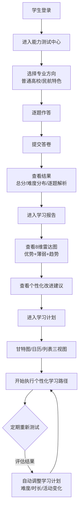
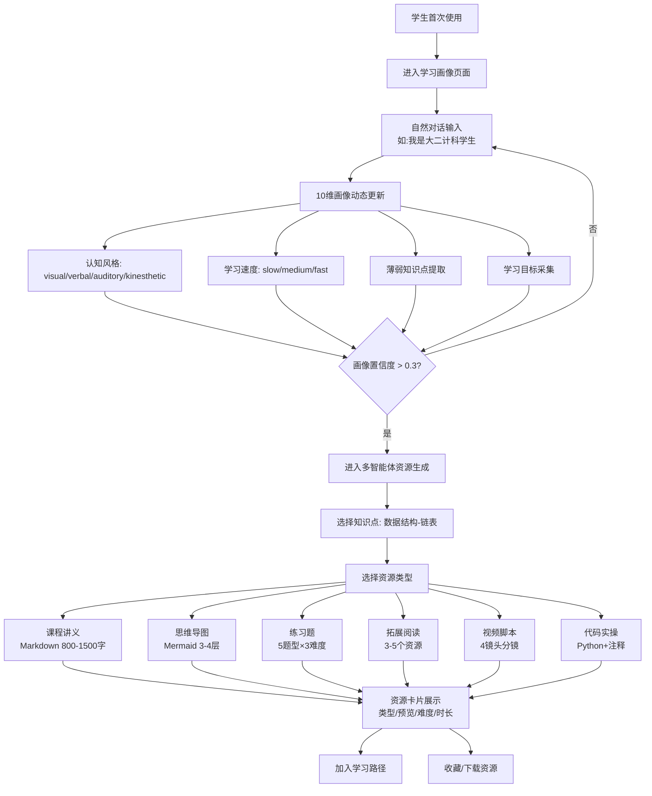
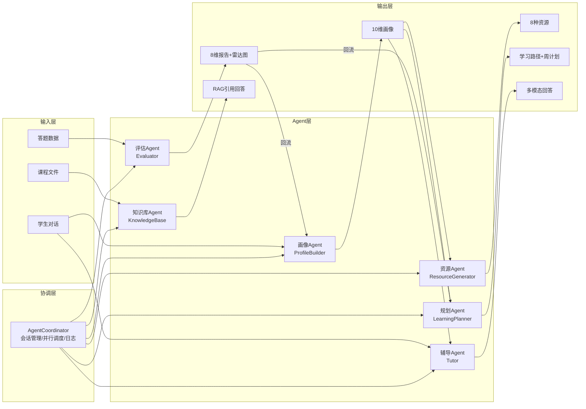

# A3 用户使用路径图

**项目名称**：大模智学  
**版本**：v2.0  
**最后更新**：2026-06-15

本文档用于补充答辩材料中的"用户使用路径图"，以Mermaid流程图形式展示系统各类用户的完整使用路径，突出系统不是单点功能，而是闭环式学习支持系统。

---

## 路径一：学生能力测试到学习计划闭环（核心演示路径）



**使用角色**：学生  
**涉及Agent**：EvaluatorAgent → LearningPlannerAgent  
**核心页面**：能力测试 → 学习报告 → 学习计划  
**关键价值**：展示"测试→诊断→计划→调整"的完整闭环

---

## 路径二：知识库上传到RAG可信问答路径（反幻觉核心路径）

```mermaid
flowchart TD
    A[学生/教师登录] --> B[进入智能问答页]
    B --> C[切换知识库管理模式]
    C --> D[上传课程资料<br/>TXT/MD/CSV/JSON/DOCX/PDF/PPTX/PPT]
    D --> D1[系统自动:<br/>解析文本/分块/关键词提取/索引建立/SHA256去重]
    D1 --> E[查看知识库状态<br/>文档数/分块数/检索引擎]
    E --> F[切换知识库问答模式]
    F --> G[输入课程问题<br/>如:什么是冯诺依曼架构?]
    G --> H[系统检索相关材料<br/>TF-IDF或ChromaDB]
    H --> I{命中材料?}
    I -->|是| J[LLM基于证据生成回答<br/>temperature=0.2]
    J --> K[返回带引用回答<br/>正文 + [来源N] + 置信度]
    I -->|否| L[返回资料不足提示<br/>建议上传课程材料]
    K --> M[继续追问或生成资源]
    L --> D
```

**使用角色**：学生 / 教师  
**涉及Agent**：KnowledgeBaseAgent → TutorAgent  
**核心页面**：智能问答  
**关键价值**：展示完整的RAG链路——"上传→解析→索引→检索→LLM生成→引用→兜底"

---

## 路径三：教师材料投喂到学生个性化支持路径

```mermaid
flowchart TD
    A[教师准备教学材料] --> B[课程讲义]
    A --> C[实验指导文档]
    A --> D[习题库与答案]
    A --> E[术语表/复习提纲]
    B --> F[教师上传到知识库]
    C --> F
    D --> F
    E --> F
    F --> G[系统建立课程知识索引]
    G --> H[学生进行知识库问答]
    G --> I[学生进行能力测试]
    G --> J[学生生成学习资源]
    H --> K[回答引用教师材料<br/>标注[来源N]]
    I --> L[评估结果反映课程掌握度]
    J --> M[基于教师材料生成<br/>讲义/题库/思维导图]
    K --> N[教师查看学生使用情况]
    L --> N
    M --> N
```

**使用角色**：教师 → 学生  
**涉及Agent**：KnowledgeBaseAgent + ResourceGeneratorAgent + EvaluatorAgent  
**核心页面**：教师上传 → 知识库 → 学生问答/测试/资源生成  
**关键价值**：展示教师如何通过知识库间接影响学生的个性化学习

---

## 路径四：对话式画像到全链路资源生成路径



**使用角色**：学生  
**涉及Agent**：ProfileBuilderAgent → ResourceGeneratorAgent → Coordinator  
**核心页面**：学习画像 → 智能问答多智能体模式  
**关键价值**：展示"画像驱动→个性化资源生成"的完整链路

---

## 路径五：多智能体协同全景路径（答辩总览用）



---

## 答辩使用建议

| 场景 | 推荐路径 | 侧重点 |
|------|---------|--------|
| 时间紧张 (3分钟) | 路径一 | "测试→报告→计划"闭环 > 快进展示 |
| 评委追问RAG | 路径二 | "上传→解析→索引→检索→LLM生成→引用→拦截"全链路 |
| 评委关注教学落地 | 路径三 | 教师如何参与系统生态 |
| 评委关注个性化 | 路径四 | 画像10维如何驱动后续所有输出 |
| 答辩总结 | 路径五 | 全景图展示系统架构完整性 |

**演示技巧**：
1. 先展示路径五的全景图，用一句话概括系统架构
2. 再用路径一快速走一遍核心闭环
3. 如果评委追问，根据问题切换到对应路径深入展开
4. 每个路径的实际操作约30-60秒，不宜过快
