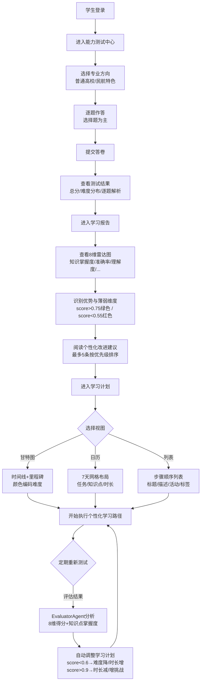
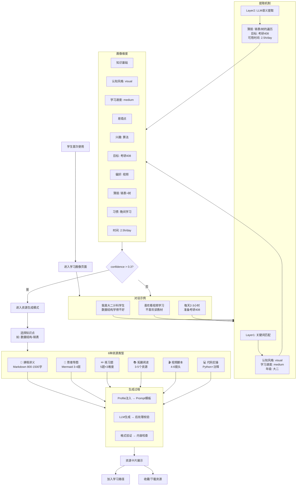

# A3 用户使用路径图

**项目名称**：大模智学  
**版本**：v3.0  
**最后更新**：2026-06-15

本文档用于补充答辩材料中的"用户使用路径图"，以Mermaid流程图形式展示系统各类用户的完整使用路径，突出系统不是单点功能，而是闭环式学习支持系统。

---

## 路径一：学生能力测试到学习计划闭环（核心演示路径）



**使用角色**：学生  
**涉及Agent**：EvaluatorAgent → LearningPlannerAgent  
**核心页面**：能力测试 → 学习报告 → 学习计划  
**关键价值**：展示"测试→诊断→计划→调整"的完整闭环

**路径时间估算**（答辩演示快速版）：

| 步骤 | 操作 | 时长 | Agent调用 |
|:--:|------|:--:|---------|
| A→B | 登录+导航 | 10秒 | - |
| C→E | 选题方向+快速作答3题+提交 | 45秒 | Evaluator |
| F→G | 查看结果+进入报告 | 15秒 | - |
| H→J | 雷达图+趋势+建议 | 30秒 | Evaluator(渲染) |
| K→M1 | 甘特图展示 | 15秒 | LearningPlanner |
| M2→M3 | 切换日历/列表 | 10秒 | - |
| 总计 | | ~2分钟 | |

**边缘路径**：
- 学生在测试中途退出 → 进度通过session保留，返回后继续
- 首次进入学习计划(无画像) → 使用默认模板路径
- 测试成绩为空(无历史)进入报告 → 显示空状态提示"请先完成能力测试"

---

## 路径二：知识库上传到RAG可信问答路径（反幻觉核心路径）

```mermaid
flowchart TD
    A[学生/教师登录] --> B[进入智能问答页]
    B --> C[切换知识库管理模式]
    C --> D[上传课程资料<br/>TXT/MD/CSV/JSON/DOCX/PDF/PPTX/PPT]
    D --> D1[系统自动处理流水线]
    
    subgraph D1 [后台处理流水线]
        direction TB
        E1[格式检测<br/>扩展名+文件头] --> E2[文本提取<br/>编码检测/PyPDF2/ElementTree]
        E2 --> E3[SHA256去重<br/>与已索引文件比对]
        E3 --> E4[智能分块<br/>800字符/120重叠/句号优先]
        E4 --> E5[关键词提取<br/>TF-IDF top-12]
        E5 --> E6[索引建立<br/>TF-IDF向量/ChromaDB嵌入]
    end
    
    D1 --> F[查看知识库状态<br/>文档数/分块数/检索引擎类型]
    F --> G[切换知识库问答模式]
    G --> H[输入课程问题<br/>如:什么是冯诺依曼架构?]
    H --> I[系统检索相关材料<br/>TF-IDF余弦相似度 or ChromaDB ANN]
    I --> J{命中材料?<br/>相似度>0.3}
    J -->|是| K[构造LLM上下文<br/>top-5检索结果拼接]
    K --> L[LLM基于证据生成<br/>temperature=0.2, max_tokens=900]
    L --> M[后处理检查]
    
    subgraph M [后处理管道]
        direction TB
        N1[Mock检测<br/>过滤"作为AI助手"模板] --> N2[幻觉检测<br/>回答与材料交叉验证]
        N2 --> N3[引用附加<br/>标注[来源N]文档名]
    end
    
    M --> O[返回带引用回答<br/>正文 + 📚来源列表 + 置信度]
    J -->|否| P[返回资料不足提示<br/>建议上传课程材料]
    O --> Q[继续追问或生成资源]
    P --> D
```

**使用角色**：学生 / 教师  
**涉及Agent**：KnowledgeBaseAgent → TutorAgent  
**核心页面**：智能问答  
**关键价值**：展示完整的RAG链路——"上传→解析→索引→检索→LLM生成→引用→后处理→兜底"

**路径时间估算**：

| 步骤 | 操作 | 时长 | 技术要点 |
|:--:|------|:--:|---------|
| A→C | 登录+切换模式 | 10秒 | - |
| D→D1 | 上传3文件 | 15秒 | 格式检测+解析 |
| F | 查看状态 | 5秒 | 确认索引完成 |
| H→I | 提问+检索 | <1秒 | TF-IDF/ChromaDB |
| K→L | LLM生成 | 2-5秒 | temperature=0.2 |
| M→O | 后处理+返回 | <1秒 | Mock+幻觉检测 |
| 总计 | | ~35秒 | |

**边缘路径与兜底**：
- 无LLM API时 → 检索材料直接拼接展示（不编造）
- LLM超时(>30s) → 降级到纯检索模式
- Mock回答检测触发 → 替换为检索材料拼接+标注
- 扫描版PDF(纯图片) → 解析返回空文本，提示OCR
- 重复文件上传 → SHA256去重，返回`deduplicated:true`
- 空文件/过小文件 → 拒绝上传，提示最小字符数
- ChromaDB未安装 → 自动回退TF-IDF，状态显示backend=tfidf

---

## 路径三：教师材料投喂到学生个性化支持路径

```mermaid
flowchart TD
    subgraph A [教师准备层]
        A1[课程讲义<br/>.txt/.docx] 
        A2[实验指导文档<br/>.md/.pdf]
        A3[习题库与答案<br/>.json/.csv]
        A4[术语表<br/>.csv]
        A5[课件PPT<br/>.pptx/.ppt]
    end
    
    subgraph B [教师操作层]
        B1[教师登录] --> B2[进入知识库管理]
        A1 & A2 & A3 & A4 & A5 --> B3[批量上传到知识库]
        B3 --> B4[系统建立课程知识索引<br/>解析+分块+关键词+向量]
        B4 --> B5[教师查看知识库状态<br/>文档数/分块数/检索引擎]
        B5 --> B6[教师进入分析工作台<br/>查看学生使用情况]
    end
    
    subgraph C [学生使用层]
        B4 --> C1[学生知识库问答<br/>基于教师材料回答]
        B4 --> C2[学生能力测试<br/>反映课程掌握度]
        B4 --> C3[学生资源生成<br/>基于教师材料生成]
        
        C1 --> D1[回答引用教师材料<br/>标注[来源N]教师讲义]
        C2 --> D2[评估结果关联<br/>课程知识点掌握度]
        C3 --> D3[资源内容与<br/>教师授课一致]
    end
    
    subgraph E [教师监控层]
        D1 & D2 & D3 --> E1[教师查看学生表现]
        E1 --> E2{分析结果}
        E2 -->|全班薄弱点| E3[调整教学重点]
        E2 -->|个体困难| E4[个性化辅导]
        E2 -->|材料不足| E5[补充教学材料]
        E3 & E4 & E5 --> A
    end
```

**使用角色**：教师 → 学生  
**涉及Agent**：KnowledgeBaseAgent + ResourceGeneratorAgent + EvaluatorAgent  
**核心页面**：教师上传 → 知识库 → 学生问答/测试/资源生成  
**关键价值**：展示教师如何通过知识库间接影响学生的个性化学习，形成"教→学→评→调"教学闭环

**教师角色定位**：
- **材料提供者**：上传课程核心资料，成为RAG回答的可信来源
- **过程监控者**：查看班级和学生个体的学习数据
- **教学调整者**：根据数据分析结果动态调整教学策略

**关键设计原则**：
1. 教师材料优先级最高（source=teacher, priority=high > sample > student）
2. 当教师材料与学生自有材料对同一问题有不同回答时，优先以教师材料为准
3. 教师上传的材料对所有选课学生自动可用

---

## 路径四：对话式画像到全链路资源生成路径



**使用角色**：学生  
**涉及Agent**：ProfileBuilderAgent → ResourceGeneratorAgent → Coordinator  
**核心页面**：学习画像 → 智能问答多智能体模式  
**关键价值**：展示"画像驱动→个性化资源生成"的完整链路，证明每一份资源都基于对学生的理解

**画像驱动效果示例**：

| 画像维度 | 值 | 对资源生成的影响 |
|---------|-----|---------------|
| cognitive_style=visual | 视觉型 | 讲义多用图表/流程图；导图结构更丰富 |
| learning_speed=slow | 慢速 | 讲义多给示例；练习题先easy难度 |
| 薄弱=链表 | 链表弱 | 链表类资源优先级最高；练习多分配 |
| 目标=考研408 | 考研导向 | 资源深度对齐408考纲；补充真题风格 |

---

## 路径五：多智能体协同全景路径（答辩总览用）

```mermaid
flowchart LR
    subgraph 输入层
        A[学生对话<br/>自然语言]
        B[课程文件<br/>8种格式]
        C[答题数据<br/>选择题+解析]
    end

    subgraph Agent层
        D[画像Agent<br/>ProfileBuilder<br/><br/>10维画像<br/>双层提取]
        E[资源Agent<br/>ResourceGenerator<br/><br/>6种资源<br/>并行生成]
        F[规划Agent<br/>LearningPlanner<br/><br/>5级里程碑<br/>动态调整]
        G[辅导Agent<br/>Tutor<br/><br/>6种答案<br/>流式SSE]
        H[评估Agent<br/>Evaluator<br/><br/>8维加权<br/>雷达图]
        I[知识库Agent<br/>KnowledgeBase<br/><br/>8格式解析<br/>双后端检索]
    end

    subgraph 协调层
        J[AgentCoordinator<br/><br/>会话管理<br/>并行调度<br/>执行日志<br/>状态一致性]
    end

    subgraph 输出层
        K[10维画像<br/>confidence动态]
        L[6种资源<br/>资源卡片]
        M[学习路径<br/>甘特图/日历/列表]
        N[多模态回答<br/>流式+引用]
        O[8维报告<br/>雷达图+趋势+建议]
        P[RAG引用回答<br/>[来源N]标记]
    end

    A --> D
    A --> G
    B --> I
    C --> H

    J --> D & E & F & G & H & I

    D --> K
    K --> E
    K --> F
    K --> G

    E --> L
    F --> M
    G --> N
    H --> O
    I --> P

    O -->|知识基础回流| D
    O -->|路径调整信号| F
    P -->|可信回答| G
```

**全景路径说明**：
- **输入层**：三类原始数据（对话文本、文档文件、答题记录）
- **Agent层**：7个Agent按教学角色分工，各自独立可测试
- **协调层**：Coordinator统一管理会话生命周期和Agent调度
- **输出层**：6类输出产物，均基于画像个性化生成
- **反馈链路**：评估结果回流到画像和路径，形成持续优化

**Agent间数据流向矩阵**：

| 从\到 | Profile | Resource | Planner | Tutor | Evaluator | KB |
|-------|:---:|:---:|:---:|:---:|:---:|:---:|
| Profile | - | 画像注入prompt | 步长因子调整 | 解释策略选择 | 前后对比 | - |
| Resource | - | - | - | 资源作为回答素材 | 练习完成度 | - |
| Planner | - | - | - | 当前阶段信息 | 计划执行进度 | - |
| Tutor | - | - | - | - | - | - |
| Evaluator | 知识基础更新 | - | 路径动态调整 | - | - | - |
| KB | - | 材料作为生成依据 | - | RAG证据提供 | 试题材料来源 | - |

---

## 答辩使用建议

| 场景 | 推荐路径 | 侧重点 | 建议时长 |
|------|---------|--------|:--:|
| 开场全景介绍 | 路径五 | 先用全景图一句话概括架构"7个Agent分工协作" | 30秒 |
| 核心流程展示 | 路径一 | "测试→报告→计划"闭环，展示学习系统性 | 2分钟 |
| 评委追问RAG | 路径二 | "上传→解析→索引→检索→LLM→引用→拦截"全链路 | 1分钟 |
| 评委关注教学落地 | 路径三 | 教师如何参与系统生态，材料优先策略 | 1分钟 |
| 评委关注个性化 | 路径四 | 画像10维如何驱动后续所有输出 | 1分钟 |
| 答辩总结 | 路径五 | 回到全景图，呼应赛题完成度 | 30秒 |

**演示技巧**：
1. 先展示路径五的全景图，用一句话概括系统架构（"7个Agent像教学团队一样分工协作"）
2. 再用路径一快速走一遍核心闭环（测试→报告→计划）
3. 如果评委追问，根据问题切换到对应路径深入展开
4. 每个路径的实际操作约30-60秒，不宜过快，让评委有时间消化
5. 记得在关键节点停顿，口述当前处于路径的哪个位置

**Mermaid渲染说明**：
- 所有流程图使用Mermaid语法编写
- 浏览器通过CDN加载mermaid.js自动渲染
- 支持点击节点查看详情
- 流程图在深墨蓝主题下自动适配配色

---

*本文档基于大模智学 v3.0 编写，5条路径覆盖全部三类用户和全功能链路。*
